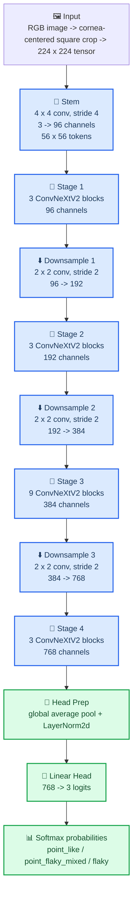
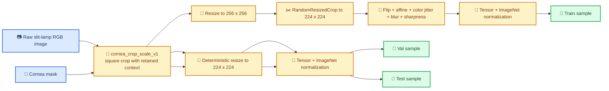

# corneal_ulcer_classification

This repository is frozen around a single active benchmark family: `pattern_3class` corneal-ulcer pattern classification from slit-lamp images. The canonical image-only benchmark is the restored ConvNeXtV2 Tiny checkpoint `pattern3__convnextv2_tiny__cornea_crop_scale_v1__augplus_v2__weighted_sampler_tempered__holdout_v1__seed42`, and the best deployed inference rule remains a separate late-fusion stack.

## Active Benchmarks

| Role | Experiment | Balanced accuracy | Macro F1 | Notes |
| --- | --- | ---: | ---: | --- |
| Official single checkpoint | `pattern3__convnextv2_tiny__cornea_crop_scale_v1__augplus_v2__weighted_sampler_tempered__holdout_v1__seed42` | `0.8482` | `0.7990` | Official image-only benchmark, ranked by balanced accuracy first and macro F1 second |
| Best deployed inference rule | `pattern3__convnextv2_tiny__crop_scale_raw_multiscale__latefusion_v1__holdout_v1__seed42combo` | `0.8563` | `0.8115` | Deployment-time ensemble rule, not the canonical single-model benchmark |

Archived families remain in the repo only as historical artifacts:

- `task_tg_5class`
- `severity_5class`

Start here if you need the frozen project state:

- [codex.md](codex.md)
- [docs/superpowers/handoffs/FINAL_MODELING_STATE_2026-04-22.md](docs/superpowers/handoffs/FINAL_MODELING_STATE_2026-04-22.md)
- [docs/superpowers/handoffs/FINAL_PATTERN_ONLY_DECISION.md](docs/superpowers/handoffs/FINAL_PATTERN_ONLY_DECISION.md)

## End-to-End Pipeline

```mermaid
flowchart LR
    accTitle: Pattern Classification Pipeline
    accDescr: End-to-end training and evaluation flow for the frozen ConvNeXtV2 Tiny corneal ulcer pattern classifier.

    manifest["📄 Manifest<br/>data/interim/manifests/manifest.csv"]
    split["🧩 Holdout Split<br/>pattern_3class_holdout.csv"]
    dataset["🖼️ Dataset Builder<br/>raw image + cornea mask path + task label"]
    roi["🎯 ROI Normalization<br/>cornea_crop_scale_v1"]
    aug["🧪 Transform Stack<br/>pattern_augplus_v2 train / deterministic eval"]
    loader["📦 DataLoaders<br/>batch=16, num_workers=4"]
    sampler["⚖️ Tempered Sampler<br/>weighted_sampler_tempered, T=0.65"]
    model["🧠 ConvNeXtV2 Tiny<br/>ImageNet pretrained"]
    head["🔢 Classification Head<br/>768 -> 3 logits"]
    loss["📉 Objective<br/>weighted cross-entropy"]
    opt["🛠️ Optimizer + Scheduler<br/>AdamW + cosine annealing"]
    select["🏁 Model Selection<br/>best val balanced accuracy"]
    test["📊 Test Evaluation<br/>balanced accuracy first, macro F1 second"]
    reports["📝 Artifacts<br/>metrics, reports, confusion matrix, ROC, PR, XAI"]

    manifest --> dataset
    split --> dataset
    dataset --> roi
    roi --> aug
    aug --> loader
    sampler --> loader
    loader --> model
    model --> head
    head --> loss
    loss --> opt
    opt --> model
    head --> select
    select --> test
    test --> reports

    classDef data fill:#dbeafe,stroke:#2563eb,stroke-width:2px,color:#1e3a5f
    classDef prep fill:#fef3c7,stroke:#d97706,stroke-width:2px,color:#78350f
    classDef train fill:#dcfce7,stroke:#16a34a,stroke-width:2px,color:#14532d
    classDef eval fill:#fce7f3,stroke:#db2777,stroke-width:2px,color:#831843

    class manifest,split,dataset data
    class roi,aug,loader,sampler prep
    class model,head,loss,opt,select train
    class test,reports eval
```

The active training path is simple on purpose: raw slit-lamp RGB is preserved, cornea supervision is used only to normalize field of view, augmentation is moderate, and the model is still a plain `convnextv2_tiny` classifier. The frozen ranking rule is unchanged throughout the repo: promote by balanced accuracy first, then macro F1.

## Detailed Architecture

### Architecture Explanation

`convnextv2_tiny` here is a four-stage hierarchical CNN with stage depths `3, 3, 9, 3` and channel widths `96, 192, 384, 768`. The stem patchifies the image with a `4 x 4` stride-`4` convolution, each later stage transition halves spatial resolution with a `2 x 2` stride-`2` convolution, and the classification head is intentionally minimal: global average pooling, `LayerNorm2d`, flatten, and a single `Linear(768, 3)` layer. There are no hidden fully connected layers in the classifier head, and the head dropout is `0.0`.

## Frozen Recipe Restore

The benchmark was re-stabilized after a recipe drift regression. The frozen fix is:

- `cornea_crop_scale_v1` again uses normalized binary cornea masks, including white-background inversion when needed.
- The ROI is a scale-normalized square crop centered on the cornea, with `context_ratio=0.18`, `min_side_ratio=0.72`, and `max_side_ratio=0.98`.
- `pattern_augplus_v2` is restored to the winning augmentation stack rather than the drifted variant.
- Regression coverage lives in:
  - [tests/test_pattern_recipe_regression.py](tests/test_pattern_recipe_regression.py)
  - [tests/test_paper_figures.py](tests/test_paper_figures.py)

## What The Pipeline Actually Uses

### Task and Data

| Component | Frozen value | Explanation |
| --- | --- | --- |
| Active task | `pattern_3class` | Only active benchmark family |
| Label column | `task_pattern_3class` | Loaded from the manifest |
| Classes | `point_like`, `point_flaky_mixed`, `flaky` | Output logits are ordered exactly this way |
| Manifest | `data/interim/manifests/manifest.csv` | Source of image paths, mask paths, and labels |
| Holdout split | `data/interim/split_files/pattern_3class_holdout.csv` | Frozen train/val/test partition |
| Split sizes | train `498`, val `106`, test `108` | Current frozen holdout counts |
| Train class counts | `251 / 183 / 64` | `point_like / point_flaky_mixed / flaky` |
| Val class counts | `53 / 39 / 14` | Class supports in validation |
| Test class counts | `54 / 41 / 13` | Class supports in test |
| Input image mode | `RGB` | No lesion-guided masking in the official path |
| Cornea mask usage | crop geometry only | Used for ROI normalization, not destructive masking |

### ROI Normalization and Transforms

| Component | Frozen value | Explanation |
| --- | --- | --- |
| Preprocessing mode | `cornea_crop_scale_v1` | Cornea-centered crop with context retained |
| Crop type | square crop around cornea bbox center | Keeps anatomical context and standardizes scale |
| Crop context margin | `0.18` on each side | Expands around the cornea bbox before resize |
| Minimum crop side | `0.72 * min(image_width, image_height)` | Prevents over-tight crops |
| Maximum crop side | `0.98 * min(image_width, image_height)` | Prevents near-full-frame overflow |
| Train image size | `224 x 224` | Final tensor size after augmentation |
| Eval image size | `224 x 224` | Deterministic resize for val/test |
| Train transform profile | `pattern_augplus_v2` | Restored official augmentation stack |
| Train resize | `256 x 256` | `Resize(image_size + 32)` before crop |
| Train random crop | `RandomResizedCrop(224, scale=(0.78, 1.0), ratio=(0.94, 1.06))` | Moderate scale jitter without destroying structure |
| Train affine jitter | `degrees=14`, `translate=(0.04, 0.04)`, `scale=(0.94, 1.06)` | Mild geometric robustness |
| Color jitter | brightness `0.22`, contrast `0.22`, saturation `0.12`, hue `0.018` | Conservative photometric augmentation |
| Blur augmentation | Gaussian blur `kernel=3`, `sigma=(0.1, 0.75)`, `p=0.2` | Small softness perturbation |
| Sharpness augmentation | `sharpness_factor=1.15`, `p=0.15` | Small local-detail perturbation |
| Normalization | ImageNet mean/std | `(0.485, 0.456, 0.406)` and `(0.229, 0.224, 0.225)` |

### What Each Image Becomes

The important distinction is that the repo does not pre-render augmented files. Every train sample is generated online from the raw RGB image at `__getitem__` time. That means one stored raw image can yield many different train-time tensors across epochs, while validation and test always stay deterministic.

### Online Augmentation Semantics

| Quantity | Frozen value | Interpretation |
| --- | ---: | --- |
| Stored raw training images | `498` | Physical train images listed in the manifest and split file |
| Stored validation images | `106` | Deterministic validation set |
| Stored test images | `108` | Deterministic test set |
| Training samples drawn per epoch | `498` | `WeightedRandomSampler(..., num_samples=len(train_set), replacement=True)` |
| Validation samples per epoch | `106` | No replacement, no random augmentation |
| Test samples per evaluation | `108` | No replacement, no random augmentation |
| Maximum train draws over the config budget | `5,976` | `498 x 12` if the run uses all configured epochs |
| Fixed offline augmented dataset size | none | Augmentations are online, not saved as extra files |
| Effective unique train images | not finite in practice | Random crop, affine, jitter, blur, and sharpness produce many distinct views of the same raw image |

For paper wording, the accurate statement is: the training split contains `498` stored raw images, but the model is trained with online augmentation and weighted sampling, so each epoch sees `498` sampled training presentations rather than a fixed expanded offline dataset. Because the transforms are stochastic and continuous-valued, the number of distinct train-time image variants is effectively unbounded.

### Expected Class Exposure Per Epoch

The tempered sampler uses per-sample weight `(1 / class_count)^0.65` with replacement. That does not flatten the class distribution completely; it partially rebalances it.

| Class | Raw train count | Raw share | Expected sampler share | Expected draws per epoch |
| --- | ---: | ---: | ---: | ---: |
| `point_like` | `251` | `50.4%` | `39.8%` | `198.0` |
| `point_flaky_mixed` | `183` | `36.7%` | `35.6%` | `177.3` |
| `flaky` | `64` | `12.9%` | `24.6%` | `122.7` |

This is why the pipeline gets more minority exposure without switching to a fully class-balanced sampler. The rare `flaky` class is seen much more often than its raw prevalence would suggest, but the sampler still preserves some natural frequency structure.

### ConvNeXtV2 Tiny Architecture

| Component | Frozen value | Explanation |
| --- | --- | --- |
| Backbone | `convnextv2_tiny` from `timm` | The official image-only backbone |
| Pretrained init | `true` | Starts from timm pretrained weights |
| Total parameters | `27,868,803` | Entire trainable model |
| Trainable parameters | `27,868,803` | Backbone is not frozen |
| Stem | `Conv2d(3, 96, kernel=4, stride=4)` + `LayerNorm2d(96)` | Patchifies the image to `56 x 56` |
| Stage depths | `3, 3, 9, 3` | Number of ConvNeXtV2 blocks per stage |
| Stage widths | `96, 192, 384, 768` | Channel widths per stage |
| Downsampling | `2 x 2` stride-`2` conv between later stages | Resolution pyramid `56 -> 28 -> 14 -> 7` |
| Feature dimension before head | `768` | `model.num_features` |
| Head type | `NormMlpClassifierHead` | timm default ConvNeXtV2 head |
| Head hidden layers | `0` | No extra hidden MLP layer in the classifier path |
| Head dropout | `0.0` | No dropout in the final head |
| Output layer | `Linear(768, 3)` | One logit per pattern class |

### Loss, Sampling, and Optimization

| Component | Frozen value | Explanation |
| --- | --- | --- |
| Loss name | `weighted_ce` | Weighted cross-entropy |
| Class weights enabled | `true` | Computed from train split only |
| Class weights | `point_like=0.4767`, `point_flaky_mixed=0.6538`, `flaky=1.8695` | Inverse-frequency style weighting normalized to mean `1.0` |
| Sampler | `weighted_sampler_tempered` | Weighted random sampling with replacement |
| Sampler temperature | `0.65` | Per-sample weight = `(1 / class_count)^0.65` |
| Relative sampler emphasis | `flaky` about `2.43x` `point_like` | Minority class gets more draws without a fully flat sampler |
| Optimizer | `AdamW` | Default optimizer in the frozen config |
| Learning rate | `1e-4` | Shared across trainable parameters |
| Weight decay | `1e-4` | Standard AdamW regularization |
| Scheduler | cosine annealing | `CosineAnnealingLR(T_max=epochs)` |
| Gradient clipping | `1.0` | Applied every step |
| AMP | `true` when device is CUDA | Mixed precision is enabled only on GPU |
| Seed | `42` | Official frozen seed |
| Selection metric | `balanced_accuracy` | Validation checkpoint selection rule |

### Training Schedule

| Component | Frozen value | Explanation |
| --- | --- | --- |
| Max epochs in canonical config | `12` | Training budget requested by config |
| Early stopping patience | `4` | Stop after four stale validation epochs |
| Batch size | `16` | Used for train, val, and test loaders |
| Num workers | `4` | Loader workers in the canonical config |
| Checkpoint criterion | best validation balanced accuracy | Saved to `best.pt` |
| Original frozen checkpoint history | not fully preserved | Final weights and metrics are preserved, but the original epoch-by-epoch CSV is not |
| Preserved current-branch control rerun | `9` epochs total, best epoch `5` | Available in `outputs/metrics/...__currentbranch_control/` and should not be confused with the official checkpoint lineage |

### Pipeline Walkthrough

1. The manifest supplies `raw_image_path`, `cornea_mask_path`, and `task_pattern_3class` for each `image_id`.
2. The frozen holdout split assigns each image to `train`, `val`, or `test`.
3. The dataset loader opens the raw RGB image and, for the official path, also loads the cornea mask.
4. `cornea_crop_scale_v1` converts the cornea mask to a normalized binary mask, finds the cornea bounding box, and extracts a square crop with context.
5. The train split then applies the restored `pattern_augplus_v2` stack online; validation and test apply only deterministic resize plus normalization.
6. The train loader uses a tempered weighted sampler with replacement, so one epoch is defined as `498` sampled training presentations.
7. ConvNeXtV2 Tiny receives `224 x 224` normalized tensors and outputs three logits through a `768 -> 3` linear head.
8. Training uses weighted cross-entropy, AdamW, cosine annealing, gradient clipping, and early stopping on validation balanced accuracy.
9. The selected checkpoint is evaluated on the frozen test set, then the repo writes metrics, reports, confusion matrices, ROC/PR curves, reliability artifacts, and Grad-CAM figures.

## Official Test Metrics

| Metric | Official checkpoint |
| --- | ---: |
| Accuracy | `0.8426` |
| Balanced accuracy | `0.8482` |
| Macro F1 | `0.7990` |
| Weighted F1 | `0.8439` |
| ROC-AUC macro OVR | `0.9621` |
| PR-AUC macro OVR | `0.9088` |
| ECE | `0.0790` |

Paper-ready evaluation figures for the official checkpoint are in:

- [outputs/paper_figures/pattern3__convnextv2_tiny__cornea_crop_scale_v1__augplus_v2__weighted_sampler_tempered__holdout_v1__seed42](outputs/paper_figures/pattern3__convnextv2_tiny__cornea_crop_scale_v1__augplus_v2__weighted_sampler_tempered__holdout_v1__seed42)

## Reproducing The Official Path

Train config:

- [configs/train_convnextv2_tiny_cornea_crop_scale_v1_augplus_v2_weighted_sampler_tempered.yaml](configs/train_convnextv2_tiny_cornea_crop_scale_v1_augplus_v2_weighted_sampler_tempered.yaml)

Main entrypoints:

- [src/main_train.py](src/main_train.py)
- [src/main_eval.py](src/main_eval.py)
- [src/model_factory.py](src/model_factory.py)
- [src/data/dataset.py](src/data/dataset.py)
- [src/data/transforms.py](src/data/transforms.py)
- [src/utils_preprocessing.py](src/utils_preprocessing.py)
- [src/evaluation/paper_figures.py](src/evaluation/paper_figures.py)

## Notes

- The dataset itself is not bundled in this repository.
- Cornea masks are used for spatial normalization in the official benchmark, not for lesion-guided supervision.
- The official single checkpoint and the deployed late-fusion rule are intentionally kept distinct.
- Any future continuation should preserve the selection rule: balanced accuracy first, macro F1 second.
